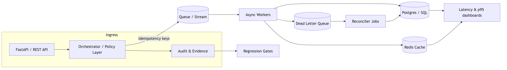

# Karan Allagh
**AI/ML Engineer (Research) • Agentic AI • Full-Stack • DevOps/MLOps • Distributed Systems • Computer Vision**

I build agentic systems end-to-end: model + retrieval + evaluation, planner → executor loops, UX, and deployment.
Reliability is how I ship AI safely — idempotency, retries/backoff, DLQ, reconciliation, audit logs, regression gates.

**Proof**
- Delivered **3× throughput** while holding **p95 ≤ 3.8s** by pairing guardrailed agent flows with regression gates + evidence bundles.
- Tuned platform schedulers for **~50% less swap thrash** and **~$40K/year infra savings** via idempotent queues, retries/backoff, and DLQ hygiene.
- Cut **38% inference cost** yet kept **60fps UI at 100k+ rows** through caching/batching, virtualization, and observability-led tuning.

**Background**: NYU MS CS (May 2026) • Samsung Research • Veach AI • Research Assistant • ES 2026 full paper accepted.

## What I build
- **Agentic AI systems** – planner → executor loops, tool use, eval harnesses, safety/guardrails, and logs that keep auditors happy.
- **ML/AI pipelines** – RAG + LLM apps, training/eval harnesses, latency/cost optimization, experiment tracking.
- **Computer Vision** – OpenCV/vision-model pipelines, dataset tooling, scoring dashboards.
- **Full-stack product** – Next.js/React frontends, FastAPI/REST backends, Postgres/Redis data layers.
- **DevOps/MLOps** – Docker/Kubernetes, CI/CD (GitHub Actions), observability, deployment runbooks.

## Featured Projects
- **Event-driven workflow orchestrator** — [workflow-orchestrator-sandbox](https://github.com/Karan-05/workflow-orchestrator-sandbox). Agent + ML pipeline engine (FastAPI + Redis + Postgres) with idempotency keys, retries/backoff, DLQ, reconciliation sweeps, and audit-ready metrics. Demo/Docs: repo README.
- **RAG evaluation + latency/cost harness** — [rag-eval-harness](https://github.com/Karan-05/rag-eval-harness). Deterministic dataset loader, caching vector store, async workers, latency/cost dashboards, and CI-ready eval harnesses that drove the 38% cost win. Demo/Docs: repo README.
- **High-volume analytics UI** — [Portfolio](https://github.com/Karan-05/Portfolio). Full-stack (Next.js + APIs + DB) analytics experience with virtualization, workerized transforms, and instrumentation to keep 60fps at 100k+ rows. Demo/Docs: https://karan-allagh.vercel.app.
- **Low-latency C++ prototyping** — Samsung/Veach internal (non-public). Near-metal agentic kernels for SIMD batching, pipeline hazard detection, and telemetry to hold p95 ≤ 3.8s. Demo/Docs: available under NDA.
- **Cloud automation agent** — [Cloud_Automation_Agent-](https://github.com/Karan-05/Cloud_Automation_Agent-). Electron + Django + Orion agent stack that plans, executes, captures evidence, and enforces guardrails for cloud operations. Demo/Docs: repo README (video WIP).

## Core strength — Distributed Systems & Reliability
- Bake reliability patterns (idempotency, retries/backoff, DLQ, reconciliation, audit logs) into every agentic or ML system to keep rollouts safe.
- Reliability is not a phase; it’s the guardrail for AI/ML features before they reach customers.

## Reliability patterns I reach for

  <picture>
    <source srcset="assets/reliability.svg" type="image/svg+xml">
    
  </picture>

## Tech stack
- **Languages**: Python, TypeScript/JavaScript, Java (Spring), C++17/20, Go, SQL, Bash.
- **ML/AI**: LLM tooling (agentic planners, RAG, eval harnesses), cost/latency tuning, dataset tooling.
- **Computer vision**: OpenCV + vision-model pipelines, dataset scoring + regression dashboards.
- **Web & APIs**: React/Next.js frontends, FastAPI/REST services, Postgres + Redis data layers.
- **Infra / DevOps / MLOps**: Docker, Kubernetes, GitHub Actions, Kafka streams, observability (logs/metrics/traces), runbooks + on-call.

## Research
- **ES 2026 accepted full paper** – *Agentic Decomposition for Reliable Long-Horizon AI Planning* (public preprint coming soon).
- Interest areas: agentic decomposition, evaluation rigor, retrieval quality, latency/cost trade-offs for LLM + CV workloads.

## What I’m looking for
Staff/Senior roles across backend platforms, reliability engineering, or AI systems (NYC hybrid or remote). Let’s collaborate on idempotent, observable, impact-driven systems.

📫 [ka3527@nyu.edu](mailto:ka3527@nyu.edu) • [LinkedIn](https://linkedin.com/in/karan-allagh) • [Portfolio](https://karan-allagh.vercel.app) • [GitHub](https://github.com/Karan-05)

## Pinned repos recommendation
1. `workflow-orchestrator-sandbox` — shows idempotency, retries/backoff, DLQ, reconciliation.
2. `rag-eval-harness` — demonstrates latency/cost benchmarking and async evaluation.
3. `Cloud_Automation_Agent-` — agentic automation with plan reviews + audit logs.
4. `Portfolio` — high-volume UI + recruiter-ready story.
5. `office-submission` — reliability patterns inside Office add-ins.
